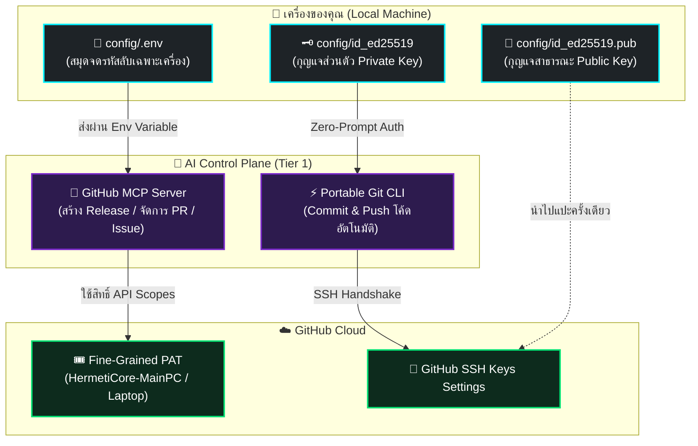

# 🔑 HermetiCore Config & Credentials Hub
### ระบบจัดการความลับ, กุญแจยืนยันตัวตน และการแยกสิทธิ์ระดับฮาร์ดแวร์
**Standard: ISO/IEC/IEEE 12207 | Two-Tier Hermetic Isolation | Zero-Leak Security**

[⬅️ กลับสู่หน้าหลัก (Back to README)](../README.md)

---

## 🏛️ 3 เสาหลักของความปลอดภัยใน HermetiCore (The 3 Pillars of Secrets)

HermetiCore ใช้หลักการ **"แยกบทบาทหน้าที่และความลับขาดจากกัน 100%"** เพื่อให้ AI Agent สามารถทำงานได้เต็มประสิทธิภาพโดยไม่มีโอกาสทำความลับรั่วไหล:



---

## 📁 1. โครงสร้างไฟล์ในโฟลเดอร์ `config/`

| ไฟล์ | สถานะใน Git | วัตถุประสงค์และการทำงาน |
|---|:---:|---|
| **`env.example`** | 📄 **Committed** | แม่แบบการตั้งค่าสภาพแวดล้อม (Template) ปลอดภัยต่อการ Push ขึ้น Public Repo |
| **`.env`** | 🔒 **Gitignored** | ไฟล์เก็บ Token ลับจริงประจำเครื่องนี้ (สร้างจาก `env.example`) |
| **`id_ed25519`** | 🔒 **Gitignored** | SSH Private Key ประจำเครื่องสำหรับ Git Operations (สร้างอัตโนมัติโดย `setup.ps1`) |
| **`id_ed25519.pub`** | 🔒 **Gitignored** | SSH Public Key สำหรับนำไปลงทะเบียนที่ [GitHub SSH Keys](https://github.com/settings/ssh/new) |

---

## 🚀 2. วิธีการตั้งค่า Fine-Grained Personal Access Token (PAT)

Token นี้ใช้สำหรับเชื่อมต่อ **GitHub MCP Server (`@modelcontextprotocol/server-github`)** เพื่อให้ AI สามารถสร้าง Release, จัดการ Issue, และรวม Pull Request ได้อัตโนมัติ

### 📋 ขั้นตอนการสร้าง Token:
1. เข้าไปที่หน้า: **[GitHub Fine-Grained Personal Access Tokens](https://github.com/settings/personal-access-tokens/new)**
2. **Token Name:** ตั้งชื่อแยกตามเครื่องชัดเจน:
   * 🖥️ เครื่องหลัก: `HermetiCore-MainPC`
   * 💻 เครื่องแล็ปท็อป: `HermetiCore-Laptop`
3. **Repository access:** ติ๊กเลือก **`All repositories`** (เพื่อให้ AI คุม Repo ย่อยทั้งหมดได้)
4. **Permissions ที่จำเป็น (Minimum Required Scopes):**

| หมวดหมู่ (Category) | รายการสิทธิ์ (Permission) | สิทธิ์ที่ต้องเลือก (Access Level) | ประโยชน์สำหรับ AI Agent |
|---|---|:---:|---|
| **📦 Repositories** | `Contents` | **Read and write** | แก้ไขโค้ด, สร้าง Git Release, อัปโหลด assets |
| | `Actions` | **Read and write** | ตรวจสอบสถานะการทดสอบ CI/CD บน Cloud |
| | `Workflows` | **Read and write** | อัปเดตและแก้ไขไฟล์ `.github/workflows/ci.yml` |
| | `Issues` | **Read and write** | เปิด Ticket ปัญหา, สรุปผล Bug อัตโนมัติ |
| | `Pull requests` | **Read and write** | สร้าง PR และรวมโค้ด (Merge) อัตโนมัติ |
| | `Custom properties` | **Read and write** | จัดการ Property ของ Repository |
| | `Secret scanning bypass` | **Read and write** | ปลดล็อกอัตโนมัติหากติด False Positive Security |
| **👤 Account** | `Email addresses` | **Read-only** | ดึงอีเมลจริงไปตั้งค่า Git Author อัตโนมัติ |
| | `Profile` | **Read-only** | ดึง Display Name และ Username ไปใช้งาน |
| | `Gists` | **Read and write** | สร้าง Snippet โค้ดสรุปแชร์ให้ผู้ใช้ |

5. กดปุ่มเขียว **`Generate token`** แล้วก๊อปปี้ Token ที่ได้ (ขึ้นต้นด้วย `github_pat_...`)
6. นำมาใส่ในไฟล์ `config/.env`:
   ```bash
   GITHUB_PERSONAL_ACCESS_TOKEN="github_pat_xxxxxxxxxxxxxxxxxxxxxxxxxx"
   ```

---

## 🗝️ 3. วิธีการตั้งค่า Ed25519 SSH Key (Zero-Prompt Git)

กุญแจ SSH ใช้สำหรับให้ Portable Git CLI สามารถ `git push` และ `git fetch` ได้ทันทีโดยไม่ต้องเด้งถามรหัสผ่าน (Zero-Prompt)

1. เมื่อรัน `setup.ps1` ระบบจะสร้างกุญแจคู่ `config/id_ed25519` และ `config/id_ed25519.pub` ให้อัตโนมัติหากยังไม่มี
2. เปิดไฟล์ `config/id_ed25519.pub` แล้วคัดลอกข้อความทั้งหมดข้างใน (ขึ้นต้นด้วย `ssh-ed25519 AAAAC3NzaC...`)
3. เข้าไปที่ **[GitHub New SSH Key](https://github.com/settings/ssh/new)**
4. ตั้งชื่อ Title: `HermetiCore-MainPC-Key` (หรือ `HermetiCore-Laptop-Key`)
5. วางข้อความ Key ลงในช่องแล้วกด **`Add SSH key`**

---

## 💻 4. การจัดการระบบหลายเครื่อง (Multi-Device Fleet: MainPC vs Laptop)

ตามกฎ **"Lost Backpack Axiom"** และการแยกขอบเขตความปลอดภัย:

> [!IMPORTANT]
> **ห้ามคัดลอกไฟล์ `.env` หรือ Private SSH Key ข้ามเครื่องเด็ดขาด!**
> ให้แต่ละเครื่อง (`MainPC` และ `Laptop`) สร้างกุญแจและ Token ของตัวเองเสมอ

### 🛡️ ข้อดีของการแยก Credential ต่อเครื่อง:
* **Blast-Radius Isolation:** หากแล็ปท็อปสูญหายหรือถูกขโมย คุณสามารถกด **Revoke** เฉพาะ Token `HermetiCore-Laptop` บนหน้า GitHub ได้ทันที โดยที่เครื่องหลัก `HermetiCore-MainPC` ไม่ต้องหยุดชะงัก
* **Audit Trail:** สามารถตรวจสอบได้จาก GitHub Security Audit Log ว่าการ Commit หรือ Release แต่ละครั้งเกิดจากเครื่อง MainPC หรือ Laptop

---

## 🛡️ 5. Zero-Leak Security Checklist (การตรวจสอบก่อน Commit)

ไฟล์ `.gitignore` ของ HermetiCore ถูกตั้งค่าบล็อกความลับไว้ 100%:
* `config/.env` $\to$ 🔒 ถูกบล็อก
* `config/*.key` $\to$ 🔒 ถูกบล็อก
* `config/id_ed25519*` $\to$ 🔒 ถูกบล็อก
* `config/env.example` $\to$ 📄 ได้รับอนุญาตให้ Track ใน Git
* `config/README.md` $\to$ 📄 ได้รับอนุญาตให้ Track ใน Git

คุณสามารถทดสอบความปลอดภัยได้ด้วยคำสั่ง:
```powershell
git status --ignored
```
จะพบว่าไฟล์ `.env` และ `id_ed25519` อยู่ในหมวด **Ignored Files** อย่างสมบูรณ์แบบ
