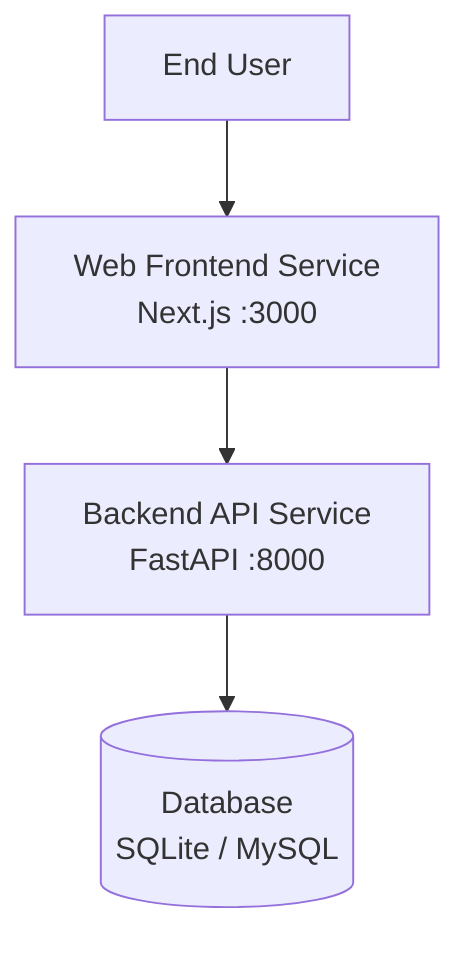

# 🏛️ Phase 1: Architecture Specification (C4 Model)

## 1. System Context Diagram (C4 Level 1)

## 2. Component Layout & Tech Stack
- **`services/web-frontend/`**: Next.js, React, Tailwind CSS, TypeScript
- **`services/api-backend/`**: Python 3.12, FastAPI, PyTorch
- **`runtime/`**: Hermetic zero-install polyglot engine

## 3. Security & Network Isolation
- Local communication over `localhost` on allocated ports.
- Zero leakage to external unapproved endpoints.
